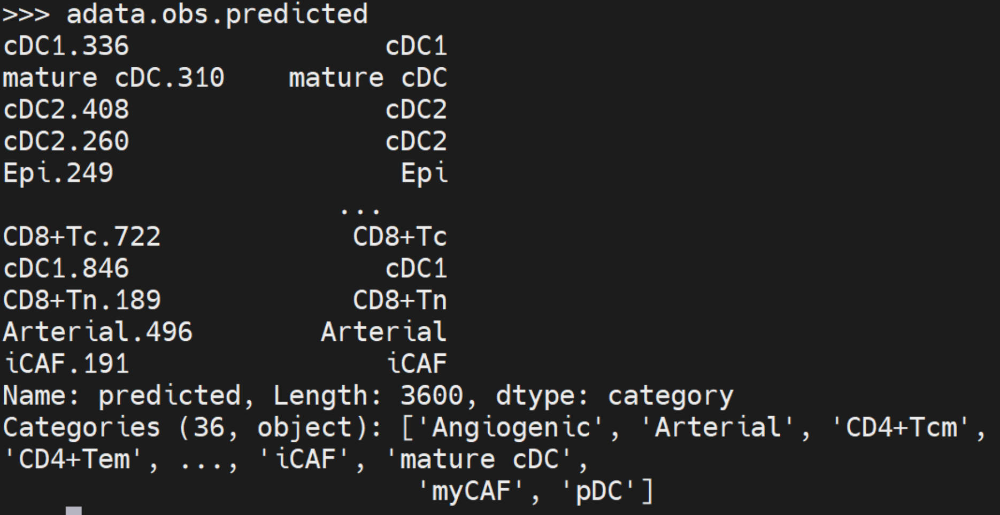

# HRCA

> HRCA (High-Resolution Cell Annotation) is a deep learning framework specifically designed for cell type annotation in high-resolution spatial transcriptomics (hr-stRNA). This novel method integrates transfer learning from single-cell RNA sequencing (scRNA-seq) data to hr-stRNA. It uses two key components: Gene-AE, for feature adaptation, and SE-Classifier, for cell typing. This method enables accurate cell type annotation even in the presence of sparse gene expression data.


# **Install for Docker**

<mark>So far, we strongly recommend using HRCA through Docker.</mark>

#### Installation of docker

[Install | Docker Docs](https://docs.docker.com/engine/install/)

#### Pull the image of HRCA

`docker pull gdawong/hrca:v1`

or

`docker pull crpi-0oscy345z4o1ndx7.cn-guangzhou.personal.cr.aliyuncs.com/gd-wong/hrca:v1`

#### Build the container
Get `[IMAGE ID of HRCA]` by,
`docker image ls`

With nvidia gpu, run

`nvidia-docker run -it --ipc=host --name hrca [IMAGE ID of HRCA] bash`

Without gpu, run

`docker run -it --ipc=host --name hrca [IMAGE ID of HRCA] bash`

Then, enter the work path in container by

`cd home`

This container can be reused after exiting. The data that needs to be annotated can be copied to the container, and the calculation results can be saved locally. For more information about the use of docker, please refer to:

[Manuals | Docker Docs](https://docs.docker.com/manuals/)

# Install for Conda

#### Git clone code

`git clone https://github.com/GD-Wong/HRCA.git`

Enter the work path by

`cd HRCA`

#### Git clone pre-trained model

Make sure you have git-lfs installed (https://git-lfs.com)

`git lfs install`

Get pre-trained model

`git clone https://huggingface.co/GD-Wong/hrca` 

or

`git clone https://hf-mirror.com/GD-Wong/hrca`

Move model to work path by

`mv hrca/*.pth .`

#### Conda install requirements

`conda env create -n hrca -f requirements.yml`

Then, activate environment by

`conda activate hrca`
#### Conda Packages (Unstable)

We also provide a Conda package that includes the functionality to train new models for annotation. This package will be further refined in the future. It can be installed as below.

`conda create -n hrca`

`conda activate hrca`

`conda config --add channels conda-forge`

`conda install gd-wong::hrca`

# Annotation

#### Example

The example is used to show the usage of HRCA through a simple command.

`python hrca.py --in_file example/ --out_file result/ --gpu_id cpu --batch_size 128 --num_workers 4`

HRCA is only compatible with [anndata - Annotated data](https://anndata.readthedocs.io/en/latest/).

The input data should be input as an `anndata` and the result will be saved in `result/` file like input data. The annotation result is saved in `anndata.obs` in `anndata`.

```python
# Run in python
# Observe the annotation results
import scanpy as sc
adata = sc.read("result/example.h5ad")
adata.obs.predicted
```



#### Parameter description

Run HRCA's annotation function with commands in the following format:

`python hrca.py --in_file [the path to input data] --out_file [the path to result data] --gpu_id [index of gpu, or cpu] --batch_size [batch size of each iteration] --num_workers [number of workers]`

Run `python hrca.py --help` for help 

**The parameters means**

`--in_file`  The file path save input data (anndata). All data in this path is annotated in turn.

`--out_file`  The file path save result data (anndata). All annotation results corresponding to the input data are stored in this path.

`--gpu_id`  The index of used gpu.  Set "cpu" to use cpu in calculation.

`--batch_size`  HRCA annotate data in multiple batches. Set the batch size. 

`--num_workers`  The number of cpu cores to used in calculation.

# Training
#### We will be providing the training code shortly.
